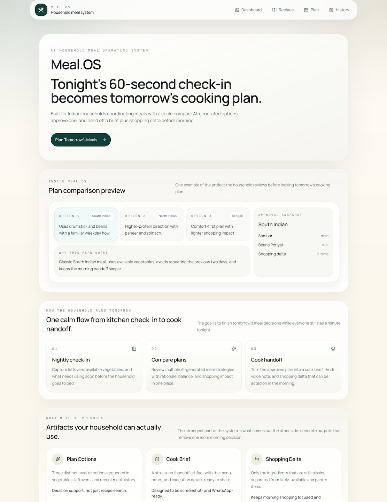
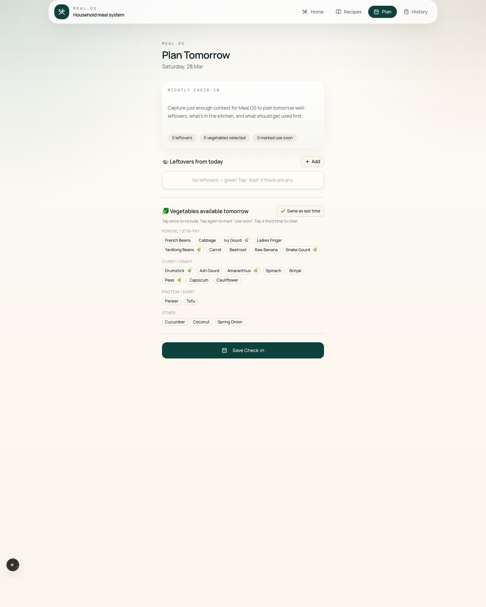
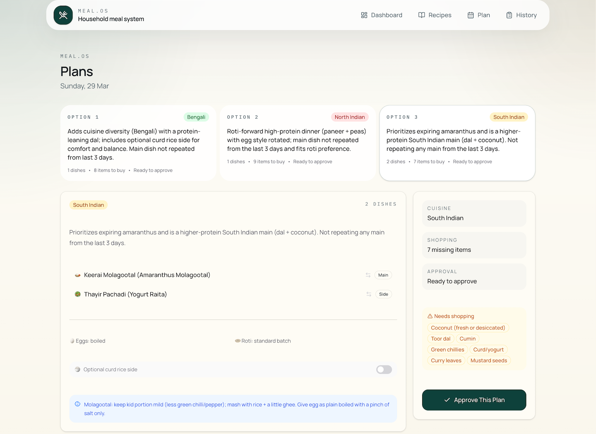
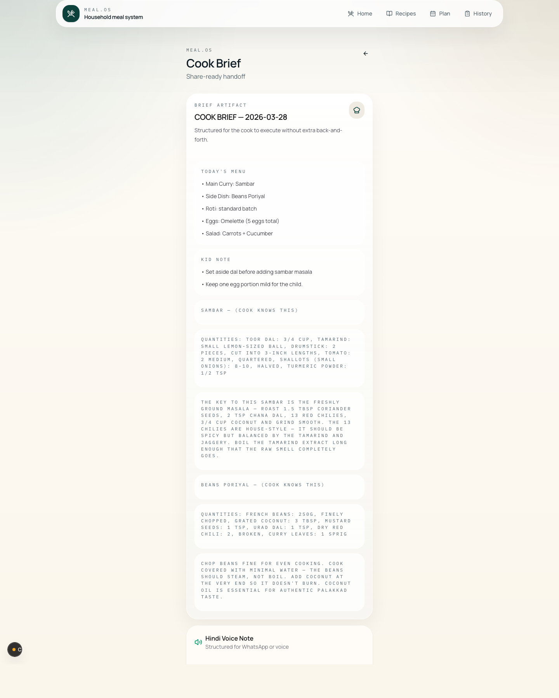

# Meal.OS

Meal.OS is an AI household meal operating system for Indian homes that need to plan dinner, prep efficiently, and hand off cooking without morning chaos.

It turns a 60-second nightly check-in into tomorrow's cooking plan:

- AI-generated plan options based on vegetables, leftovers, and recent meal history
- a structured cook brief for the approved plan
- a WhatsApp-ready voice-note handoff
- and a delta shopping list for only what is still missing

## Product Screens

<p align="center">
  
</p>

<p align="center">
  
</p>

<p align="center">
  
</p>

<p align="center">
  
</p>

## Why it feels different

Meal.OS is built around household execution, not recipe browsing. The system connects planning, cook communication, and next-morning shopping into one operating loop.

- India-first meal planning and household rules
- leftover-aware suggestions that reduce waste
- plan comparison instead of one-shot meal generation
- cook-brief and voice-note outputs that a household can actually use
- lightweight household memory so the planner avoids repetition

## Demo Flow

The strongest demo path is:

`Home -> Check-in -> Plans -> Cook Brief`

That flow shows the full operating loop from household signal capture to execution handoff.

## Stack

- Frontend: Next.js, React, Tailwind CSS, Vitest
- Backend: FastAPI, SQLAlchemy, Alembic, pytest
- AI: Azure OpenAI
- Voice: Azure Cognitive Services Speech

## Repository Layout

```text
backend/   FastAPI API, models, services, seed data, tests
frontend/  Next.js app, UI components, frontend tests
docs/      Public docs and assets
```

## Quick Start

### 1. Backend

```bash
cd backend
python3 -m venv .venv
source .venv/bin/activate
pip install -r requirements.txt
cp ../.env.example .env
python -m uvicorn app.main:app --reload --port 8000
```

### 2. Frontend

```bash
cd frontend
npm ci
cp ../.env.example .env.local
npm run dev
```

The frontend expects the API at `http://localhost:8000` by default.

## Demo Data

On a clean database, the dashboard starts with the nightly check-in flow.
If you want a populated demo state for screenshots or a guided walkthrough,
load the public-safe demo seed:

```bash
cd backend
python -m app.seed.seed_demo_state
```

This seeds:

- one approved plan for tomorrow
- three comparison plans for the following day
- recent meal history
- and vegetable snapshots for the planner

To reset back to a clean first-run state locally, delete `backend/meal_os.db`
and restart the backend.

## Environment Variables

The repo includes a root `.env.example` with the variables used by both apps.

Required for the full AI and voice flow:

- `AZURE_OPENAI_ENDPOINT`
- `AZURE_OPENAI_API_KEY`
- `AZURE_OPENAI_DEPLOYMENT_NAME`
- `AZURE_SPEECH_KEY`
- `AZURE_SPEECH_REGION`

The app still runs without cloud credentials, but AI- and TTS-powered features will not be available.

## Testing

Frontend:

```bash
cd frontend
npx vitest run
```

Backend:

```bash
cd backend
pytest -v
```

## Status

Meal.OS is an active hackathon prototype and public demo repo for an AI household meal operating system.
